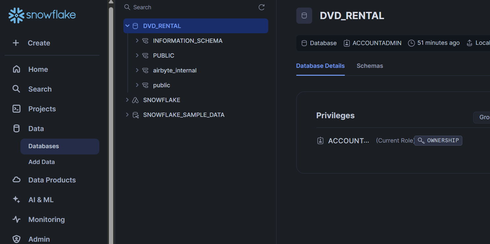
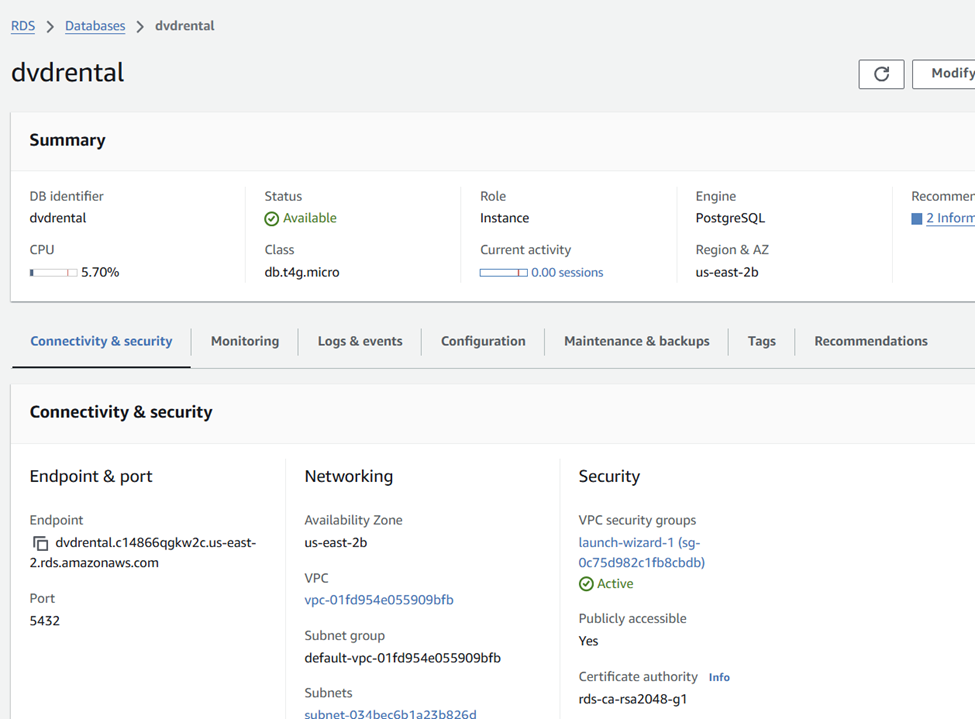
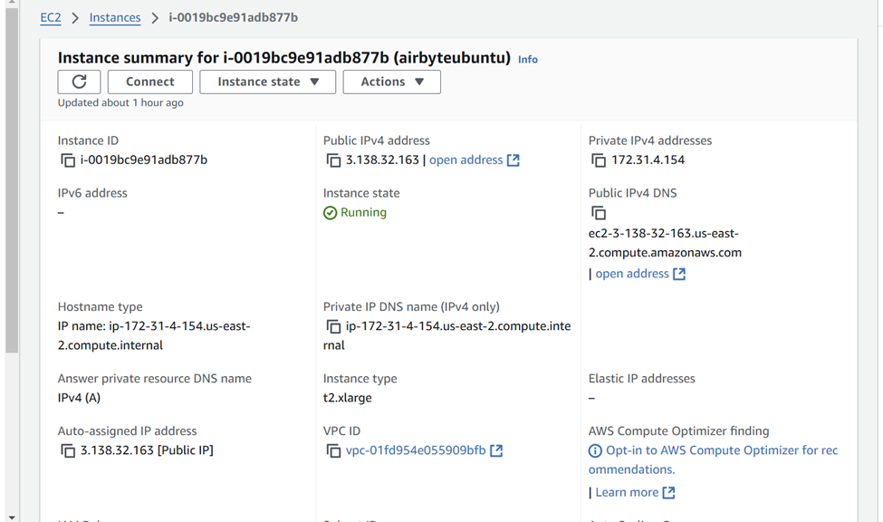
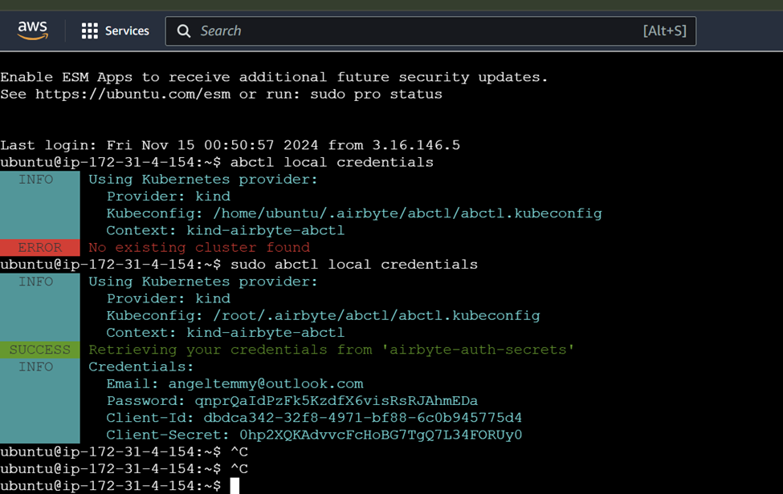
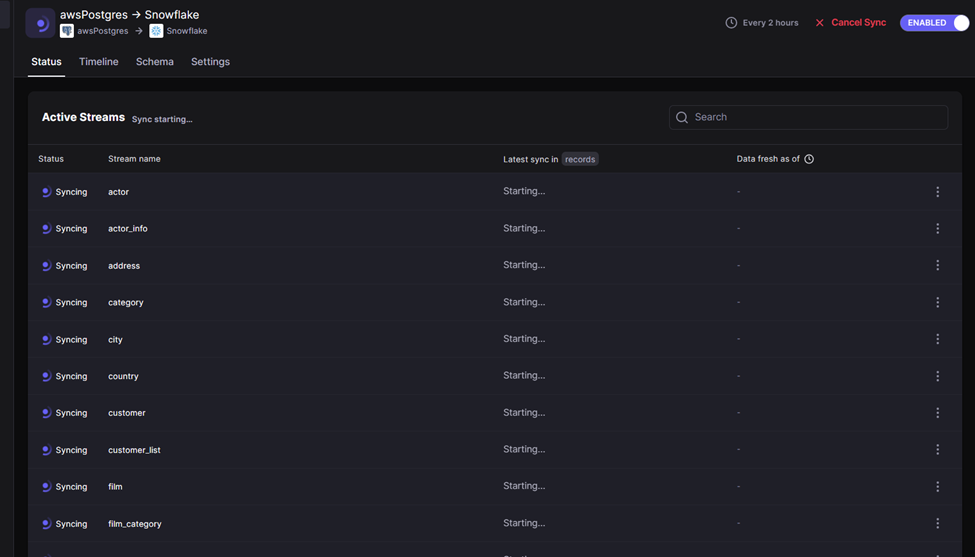

# debootcamp-project2

## Objective
The objective of this ELT project is to provide insights into the DVD rental business operations, allowing stakeholders to make data-driven decisions. The data should empower users to:

Track rental trends, including popular movies and high-demand genres
Analyze customer behaviors, such as rental frequency and preferred rental formats
Monitor inventory to optimize stock and ensure availability of popular titles
Enhance marketing efforts by understanding customer demographics and preferences
Support financial planning through revenue tracking and trend analysis

## Consumers of Your Data:
The primary consumers of the data for the DVD rental database would include:

Business Analysts - For creating reports on rental performance, customer engagement, and revenue generation.
Marketing Team - To tailor marketing campaigns based on customer demographics and rental preferences.
Inventory Managers - For maintaining optimal stock levels based on rental demand patterns.
Customer Service Team - To understand and improve the customer rental experience.
Executives and Financial Planners - For high-level strategic planning, focusing on growth areas, and budget allocation.

## Questions 
- What are the most rented movies, and how has their popularity changed over time?
- Which genres or categories are the most popular among customers?
- Are there seasonal trends in rental activity, and if so, when are the peak periods?
- What is the average rental duration by genre or by movie?

## Source datasets

### Datasets Selected:
|Data source name|URL|
|--|--|
|DVD Rental Database| https://www.postgresqltutorial.com/postgresql-getting-started/postgresql-sample-database/|
The DVD Rental Database includes the following datasets:

# Solution Architecture

## Tools Used
### 1. RDS Postgresql
- The DVD_RENTAL database is an example of an OLTP system running on PostgreSQL. It features several tables that simulate the operations of a dvd rental company

### 2. Snowflake 
- We chose to use Snowflake as our data warehouse because it offers scalable cloud-based architecture and fast query performance with separate storage and compute resources. 

### 3. Airbyte
- we hosted Airbyte on an Ubuntu OS EC2 instance. Airbyte is used as a tool to extract and integrate data from our source database to our snowflake data warehouse.

### 4. DBT
- We chose DBT as our tool to transform our staging, marts, and reports tables, ensuring each table schema aligns with our designed specifications.

### 5. run_pipeline.sh as Orchestrator
- To orchestrate the integration and transformation processes, we opted to use a bash script to ensure the correct sequence of execution.

### 6. Preset
- We chose Preset as our BI tool to visualize and analyze our transformed data.

## Steps of Implementation
### 1. Setup Source Database
- Set up a postgresSQL datbase on AWS RDS and store its credential on AWS Secret Manager.
- Load northwind data from northwind.sql provided on northwind github repo (https://github.com/pthom/northwind_psql)

- Change Data Capture (CDC)
   

### 2. Set up Airbyte 
- Set up airbyte on AWS EC2 and connect it by ssh
    - Launch ubuntu EC2 instance with secret key 
    - Install Docker and Docker compose
    - download airbyte to EC2 by cloning the airbyte repo
    - access airbyte thourgh ssh 

### 3. Airbyte ELT pipeline

### 4. Transform data using DBT

### 5. Orchestration

### 6. Visulaization 

### 7. Schedule pipeline with ECS and ECR

## Limitations and Lessons Learned

